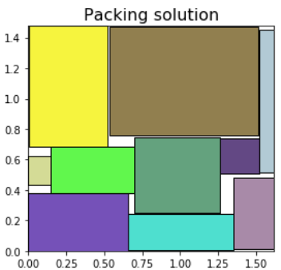
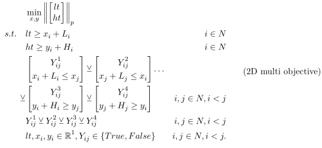
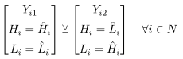

# Generalized Disjunctive Programming for solving the Strip-packing problem
## Report
Please refer to the [full report](./APSE_report.pdf) for a detailed description of the method and the results.
## Abstract
> Generalized Disjunctive Programming is a modeling formulation similar to Mixed Integer Nonlinear Programming,
> but additionally allowing ’choices’ between different constraints.
> In this project, we investigate the usage of GDP in modeling of strip-packing problems.
> We consider the effect of different formulations for the objective function 
> and consider different model formulations, including packing 2D and 3D problems, 
> as well as rotating and fixed boxes.

## Result examples
  2D optimization             | 3D optimization
:-------------------------:|:-------------------------:
 | 

This example shows solving the Strip-packing problem for randomly generated boxes, in 2D and 3D.
In these examples, the L-infinity norm is minimized.
More examples are shown in the report.

## Mathematical setup
The problem of optimizing the arangement of boxes with known size can be set up using 
the Generalized Disjunctive Programming (GDP) framework, which can for example be modeled
in [Pyomo](https://pyomo.readthedocs.io/en/stable/modeling_extensions/gdp/index.html)
and solved with [Gurobi](https://www.gurobi.com/).
The problem equations are

and rotation can be allowed by introducing the disjunctions

More details can be found in the report.
