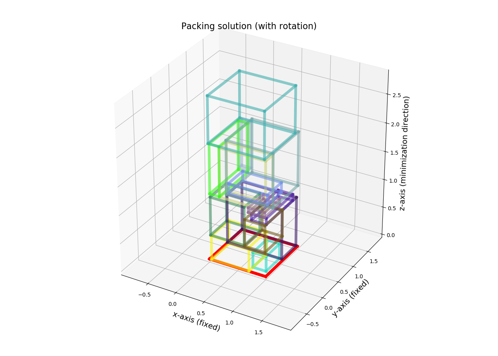

# Generalized Disjunctive Programming for solving the Strip-packing problem
## Report
Please refer to the [full report](./APSE_report.pdf) for a detailed description of the method and the results.
## Abstract
> Generalized Disjunctive Programming is a modeling formulation similar to Mixed Integer Nonlinear Programming,
> but additionally allowing ’choices’ between different constraints.
> In this project, we investigate the usage of GDP in modeling of strip-packing problems.
> We consider the effect of different formulations for the objective function 
> and consider different model formulations, including packing 2D and 3D problems, 
> as well as rotating and fixed boxes.

  2D optimization             | 3D optimization
:-------------------------:|:-------------------------:
 | 

This example shows solving the Strip-packing problem for randomly generated boxes, in 2D and 3D.
In these examples, the L-infinity norm is minimized.
More examples are shown in the report.
